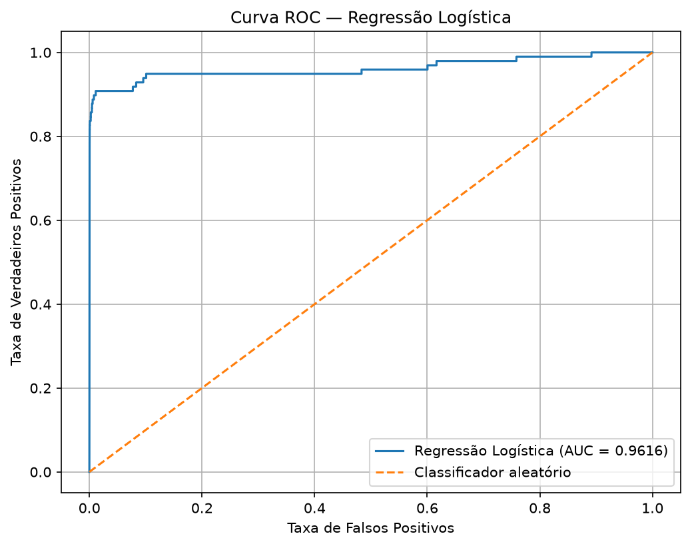
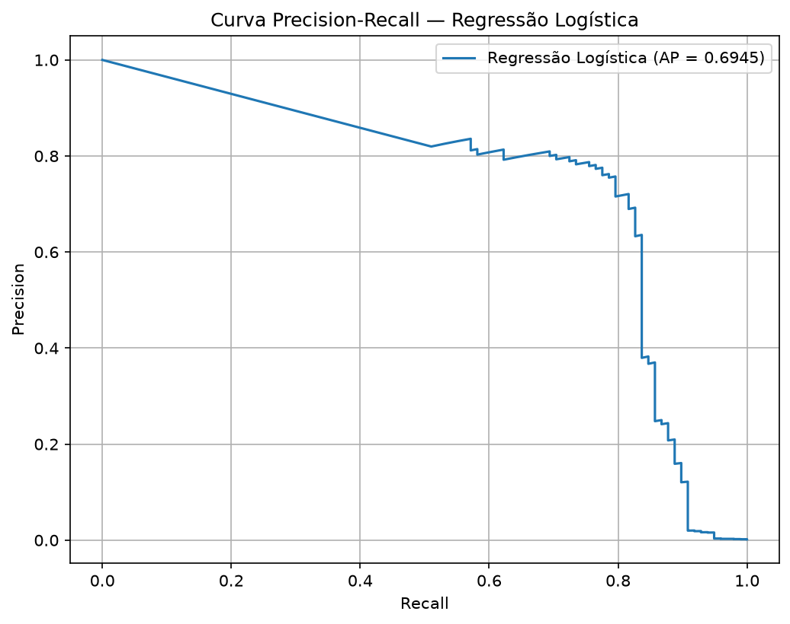
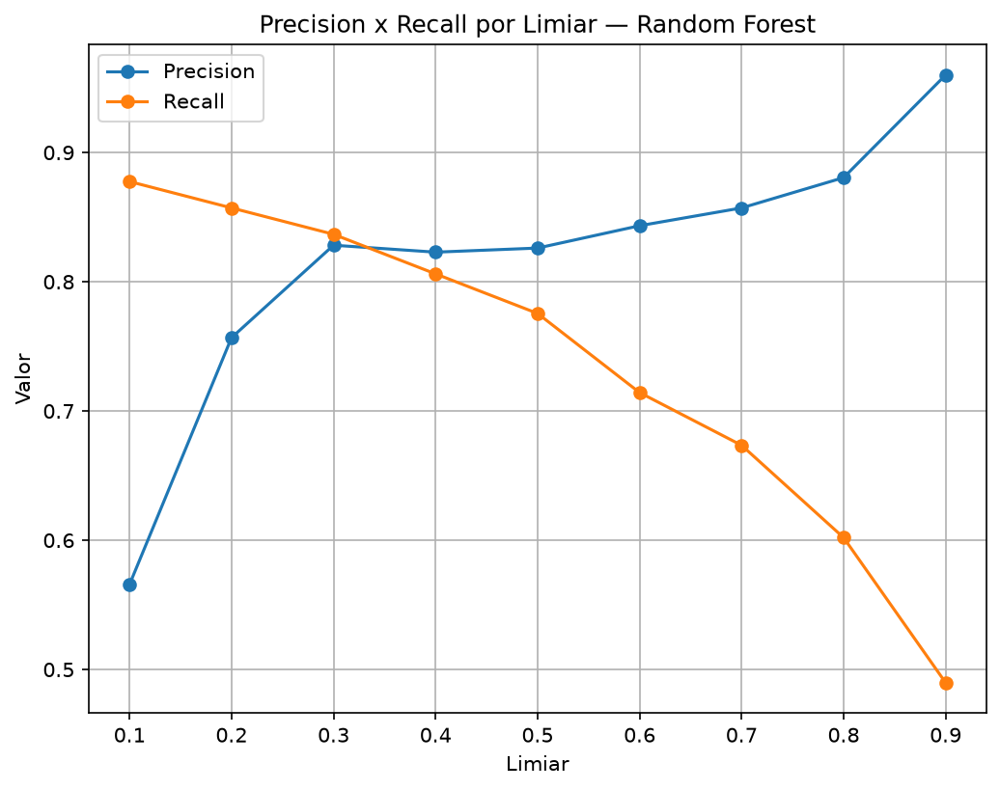
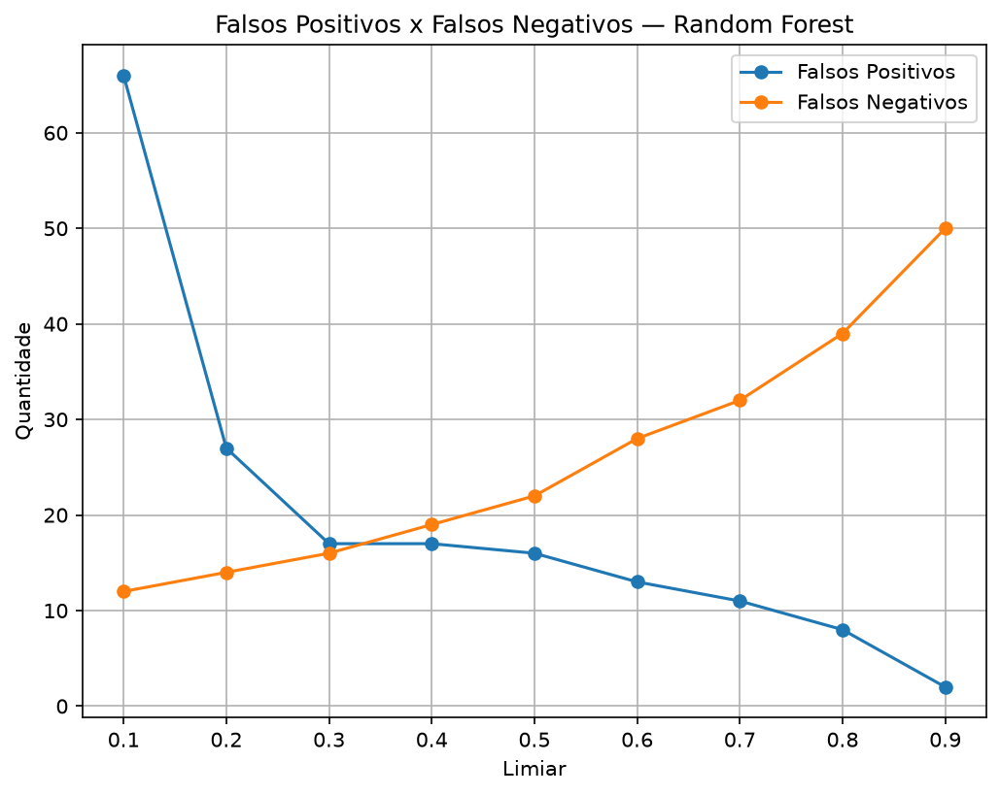
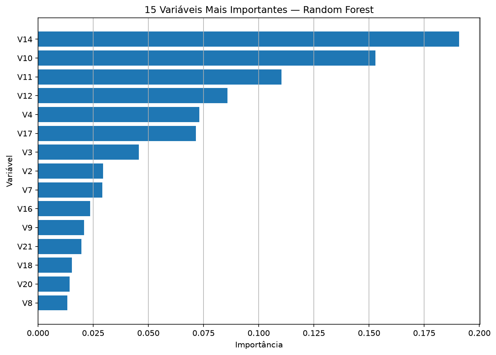
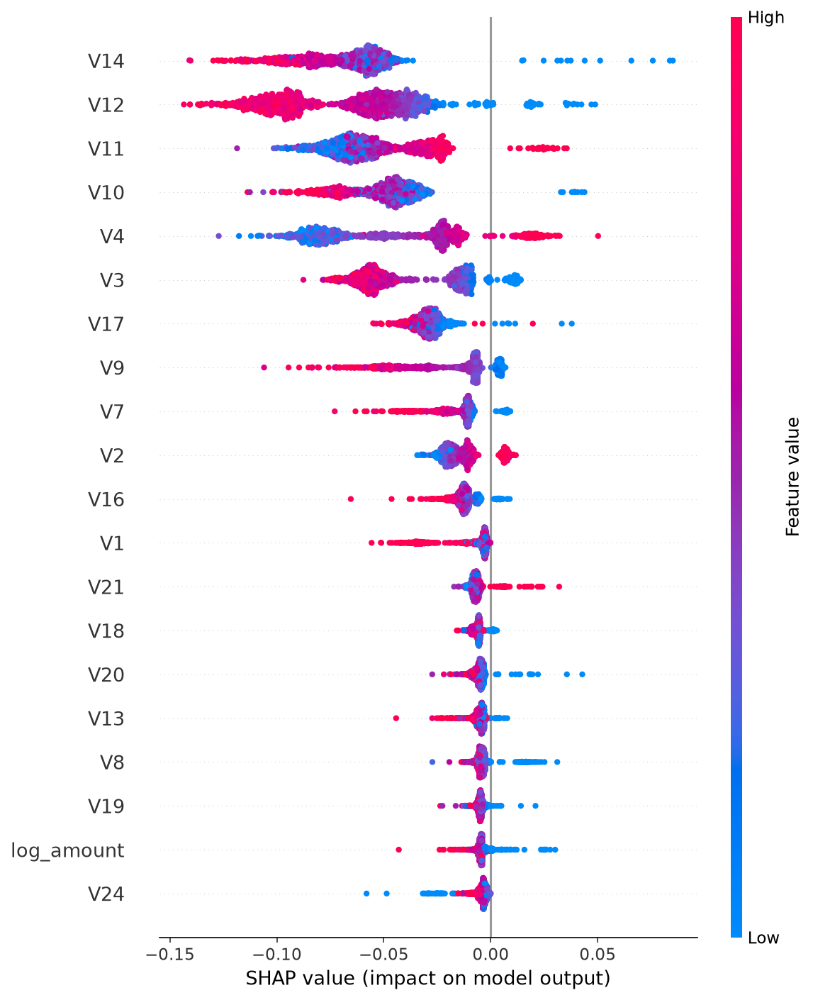

# 📚 Miniguia de Estudos e Engenharia de Prompts com IA

Este repositório reúne atividades práticas de aprendizagem ativa com Inteligência Artificial, utilizando ferramentas como NotebookLM, engenharia de prompts e análise estruturada de informações.

O projeto está dividido em três desafios práticos:

* **Desafio 1:** Miniguia de Estudos em Finanças Introdutórias;
* **Desafio 2:** Extraindo Insights do Feedback de Clientes Bancários.
* **Desafio 3:** Detecção de Fraudes com Machine Learning.

---

# 💰 Desafio 1 — Miniguia de Estudos em Finanças Introdutórias

## 🎯 Contexto e Objetivos

Este projeto nasceu de um desafio de aprendizagem ativa com Inteligência Artificial. O objetivo é criar um caderno temático sobre finanças introdutórias no NotebookLM, reunindo fontes abertas e confiáveis, explorando perguntas estratégicas, testando diferentes prompts e consolidando os principais aprendizados em um miniguia de estudo.

A proposta busca utilizar a IA não apenas para obter respostas prontas, mas como uma ferramenta de apoio à aprendizagem ativa, à organização do conhecimento e ao desenvolvimento do pensamento crítico.

### Objetivos principais

* Entender os fundamentos do orçamento doméstico;
* Diferenciar poupança de investimento;
* Compreender crédito, juros e endividamento;
* Entender os impactos da inflação no poder de compra;
* Explorar práticas internacionais de alfabetização financeira;
* Desenvolver prompts reutilizáveis para futuras revisões.

---

## 📚 Curadoria de Fontes

Foram selecionadas cinco fontes abertas e confiáveis, priorizando instituições oficiais e materiais educacionais relacionados à educação financeira e à alfabetização financeira.

| Fonte                                                           | Tipo       | Link                                                                                                                                     |
| --------------------------------------------------------------- | ---------- | ----------------------------------------------------------------------------------------------------------------------------- |
| Caderno de Educação Financeira – Banco Central                  | PDF/Página | [Banco Central](https://www.bcb.gov.br/cidadaniafinanceira)                                                                   |
| Guia de Planejamento Financeiro – CVM                           | PDF        | [Guia CVM](https://www.gov.br/investidor/pt-br/educacional/publicacoes-educacionais/guias/guia-de-planejamento-financeiro/guia-planejamento-financeiro.pdf)       |
| TOP Planejamento Financeiro Pessoal – CVM                       | Página     | [CVM](https://www.gov.br/cvm/pt-br/assuntos/noticias/2025/cvm-lanca-2a-edicao-do-livro-top-planejamento-financeiro-pessoal)   |
| Entendendo a Inflação – IBGE                                    | Página     | [IBGE](https://educa.ibge.gov.br/jovens/materias-especiais/23189-entendendo-a-inflacao.html)                                  |
| OECD/INFE 2023 International Survey of Adult Financial Literacy | PDF        | [OECD Report](https://www.oecd.org/content/dam/oecd/en/publications/reports/2023/12/oecd-infe-2023-international-survey-of-adult-financial-literacy_8ce94e2c/56003a32-en.pdf) |

### Critérios de seleção

As fontes foram escolhidas considerando:

* Confiabilidade das instituições responsáveis;
* Disponibilidade pública e gratuita;
* Relação direta com o tema estudado;
* Conteúdo adequado para estudantes iniciantes;
* Diversidade de perspectivas sobre educação financeira;
* Possibilidade de utilização no NotebookLM.

---

## ❓ Perguntas Estratégicas

As perguntas foram elaboradas para explorar diferentes níveis de aprendizagem.

### Compreensão

* Quais são os passos para elaborar um orçamento pessoal?
* Qual é a diferença entre receita e despesa?
* Como os juros influenciam empréstimos e investimentos?

### Comparação

* Explique a diferença entre poupança e investimento com exemplos práticos.
* Compare orçamento pessoal e planejamento financeiro.
* Quais são as diferenças entre as abordagens brasileiras e internacionais sobre alfabetização financeira?

### Análise

* Como a falta de planejamento financeiro pode contribuir para o endividamento?
* Como a inflação interfere no poder de compra?
* Quais comportamentos financeiros diferenciam países segundo a OECD?

### Aplicação prática

* Como uma pessoa pode organizar suas finanças mensais?
* Crie um exemplo de orçamento doméstico para uma pessoa que deseja reduzir gastos.
* Como os conceitos estudados podem ajudar uma pessoa a evitar o endividamento?

---

## 🤖 Engenharia de Prompts

Durante o projeto, foram testadas diferentes formas de formular perguntas para observar como a estrutura do prompt influencia a qualidade das respostas.

### Prompt inicial

> Quais os passos para elaborar um orçamento pessoal?

### Prompt melhorado

> Com base exclusivamente nas fontes disponíveis no NotebookLM, explique os passos para elaborar um orçamento pessoal e apresente um exemplo prático de organização mensal.

**Aprendizado:** adicionar contexto, limitar as fontes e solicitar exemplos práticos torna a resposta mais específica e útil.

---

### Prompt de comparação

> Explique a diferença entre poupança e investimento com exemplos práticos.

### Prompt melhorado

> Compare poupança e investimento com base nas fontes disponíveis, considerando objetivo, risco, liquidez e prazo.

**Aprendizado:** definir critérios de comparação melhora a organização da resposta.

---

### Prompt de análise internacional

> Quais comportamentos financeiros diferenciam países segundo a OECD?

### Prompt melhorado

> Com base no relatório OECD/INFE e nas fontes brasileiras selecionadas, compare os principais conhecimentos, comportamentos e atitudes relacionados à alfabetização financeira.

**Aprendizado:** combinar fontes permite construir uma visão mais ampla e comparativa sobre o tema.

---

## 🩹 Cicatrizes e Troubleshooting

Durante a utilização do NotebookLM, algumas dificuldades foram encontradas.

### Respostas muito genéricas

**Problema:** perguntas muito amplas geravam respostas pouco específicas.

**Solução:** adicionar contexto e solicitar exemplos práticos.

**Aprendizado:** a qualidade da pergunta influencia diretamente a qualidade da resposta.

---

### Glossário incompleto

**Problema:** alguns conceitos importantes não apareciam no primeiro resultado.

**Solução:** solicitar explicitamente uma lista de termos com definições curtas e linguagem adequada para iniciantes.

**Aprendizado:** definir formato e critérios melhora a qualidade do resultado.

---

### Falha no processamento de fonte

**Problema:** a página "Entendendo a Inflação", do IBGE, apresentou falha ao ser adicionada diretamente ao NotebookLM.

**Solução:** testar alternativas, como utilizar o conteúdo em formato PDF ou selecionar outra fonte compatível.

**Aprendizado:** diferentes formatos e páginas podem apresentar comportamentos diferentes em ferramentas de IA.

---

## 🧪 Teste — O que é Educação Financeira?

### Prompt utilizado

> O que é educação financeira?

### Resposta obtida

A educação financeira foi definida como um meio de promover comportamentos que contribuem para melhorar o bem-estar financeiro e o exercício da cidadania financeira.

A resposta também apresentou a educação financeira como uma combinação de:

* Conscientização;
* Conhecimento;
* Habilidades;
* Atitudes;
* Comportamentos.

Além disso, foram destacados aspectos relacionados a:

* Planejamento financeiro;
* Consumo;
* Poupança;
* Investimentos;
* Prevenção de riscos;
* Proteção do patrimônio.

A resposta também indicou que decisões financeiras não dependem apenas de conhecimentos matemáticos, mas podem estar relacionadas ao comportamento, às emoções, aos impulsos e às escolhas de consumo.

### Resultado observado

Mesmo utilizando um prompt curto e genérico, a resposta apresentou uma visão ampla sobre educação financeira.

A resposta não se limitou a uma definição simples e relacionou o tema ao bem-estar financeiro, à cidadania financeira, ao comportamento e ao desenvolvimento econômico.

### Cicatriz identificada

Um possível ponto de atenção é que uma resposta ampla pode apresentar muitos conceitos ao mesmo tempo, dificultando a utilização como material de revisão rápida.

### Possível melhoria do prompt

> Com base nas fontes deste notebook, explique o que é educação financeira em linguagem simples e apresente apenas os três conceitos mais importantes para um estudante iniciante.

### Aprendizado

Este teste demonstrou que um prompt simples pode gerar uma resposta rica, mas nem sempre apresenta o conteúdo no formato mais adequado para revisão.

O refinamento do prompt pode ajudar a controlar a profundidade, o tamanho e a organização da resposta.

---

## 📖 Miniguia de Estudo

### 💰 Orçamento

O orçamento é uma ferramenta utilizada para organizar receitas e despesas.

Ele permite:

* Conhecer quanto dinheiro é recebido;
* Identificar os principais gastos;
* Reduzir desperdícios;
* Planejar objetivos financeiros;
* Tomar decisões mais conscientes.

---

### 💳 Crédito

O crédito permite utilizar recursos financeiros antes de possuir o dinheiro necessário.

Pode ser útil em determinadas situações, mas exige atenção aos:

* Juros;
* Prazos;
* Condições de pagamento;
* Risco de endividamento.

---

### 📈 Investimentos e Poupança

A poupança está relacionada à reserva de dinheiro para utilização futura.

Os investimentos envolvem diferentes alternativas para aplicação de recursos, considerando fatores como:

* Risco;
* Rentabilidade;
* Liquidez;
* Prazo.

---

### 📉 Inflação

A inflação representa o aumento generalizado dos preços de produtos e serviços.

Um dos seus principais efeitos é a redução do poder de compra do dinheiro ao longo do tempo.

---

### 🌎 Alfabetização Financeira

A alfabetização financeira envolve conhecimentos, comportamentos e atitudes que ajudam as pessoas a tomar decisões financeiras mais conscientes.

A análise da OECD permite observar o tema também em uma perspectiva internacional.

---

## 📘 Glossário

| Conceito        | Definição                                                                                 |
| --------------- | ----------------------------------------------------------------------------------------- |
| Liquidez        | Facilidade de converter um ativo em dinheiro                                              |
| Juros compostos | Juros calculados sobre o valor inicial e sobre os juros acumulados                        |
| Endividamento   | Situação relacionada ao acúmulo de compromissos financeiros e dívidas                     |
| Inflação        | Aumento generalizado dos preços                                                           |
| Poder de compra | Quantidade de bens e serviços que determinada quantia de dinheiro consegue adquirir       |
| Crédito         | Possibilidade de utilizar recursos financeiros antes de possuir o dinheiro correspondente |
| Orçamento       | Organização das receitas e despesas                                                       |
| Investimento    | Aplicação de recursos com objetivos financeiros futuros                                   |

---

## ♻️ Prompts Reutilizáveis

### Para resumo

> Resuma em cinco linhas o módulo sobre crédito presente nas fontes disponíveis.

### Para criação de glossário

> Monte um glossário com 10 termos financeiros básicos presentes nas fontes e apresente definições curtas para iniciantes.

### Para comparação

> Compare a visão da OECD com as fontes brasileiras sobre alfabetização financeira.

### Para revisão

> Crie cinco perguntas sobre os principais conceitos estudados. Não apresente as respostas imediatamente.

### Para aplicação prática

> Crie uma situação fictícia de uma pessoa com dificuldades financeiras e explique como os conceitos presentes nas fontes podem ajudá-la.

---

## 🎓 Principais Aprendizados

O desenvolvimento deste projeto demonstrou que a Inteligência Artificial pode apoiar significativamente a organização e a revisão de conteúdos.

Entretanto, a qualidade dos resultados depende de fatores como:

* Qualidade das fontes selecionadas;
* Clareza dos objetivos;
* Formulação das perguntas;
* Estrutura dos prompts;
* Verificação das referências;
* Capacidade crítica do estudante.

A principal conclusão do projeto é que a IA pode acelerar a organização da informação, mas o pensamento crítico continua sendo essencial para transformar informação em conhecimento.

---------------------------------------------------------------------------------------------------------------------------------------------------------------------------------------------------------------------------
---------------------------------------------------------------------------------------------------------------------------------------------------------------------------------------------------------------------------

# 🎯 Desafio 2 — Extraindo Insights do Feedback de Clientes Bancários

## 🎯 Contexto e Objetivo

Este desafio tem como objetivo explorar o uso de Inteligência Artificial para analisar feedbacks de clientes sobre a experiência de uso de um aplicativo bancário.

A proposta é construir e refinar um prompt capaz de transformar comentários de clientes em informações organizadas e úteis para apoiar decisões relacionadas à experiência do cliente e à melhoria do aplicativo.

---

## 1. 🎯 Definição da Intenção

### Tipo de feedback

Feedbacks de clientes relacionados à experiência de uso de um aplicativo bancário, incluindo acesso à conta, navegação e utilização das funcionalidades disponíveis.

### Usuários do resultado

As informações serão utilizadas pelas equipes de experiência do cliente e desenvolvimento digital.

### Decisões apoiadas

O resultado deverá apoiar decisões relacionadas à melhoria da usabilidade, da experiência dos usuários e do funcionamento do aplicativo.

### Formato esperado

A entrega deverá conter:

* Resumo executivo;
* Principais temas identificados;
* Classificação dos feedbacks;
* Principais prioridades;
* Recomendações de possíveis ações;
* Limitações da análise.

### Critério de qualidade

O resultado será considerado adequado quando apresentar informações claras, organizadas, baseadas exclusivamente nos feedbacks fornecidos e úteis para identificar as principais prioridades de melhoria.

---

## 2. 🧩 Contexto e Restrições

### Contexto

Trabalho com a análise de feedbacks de clientes relacionados à experiência de uso de um aplicativo bancário, incluindo aspectos como acesso à conta, navegação e utilização das funcionalidades disponíveis.

### Dados disponíveis

* Data do feedback;
* Texto do comentário;
* Funcionalidade mencionada;
* Nota de satisfação.

Esses dados serão considerados conforme sua disponibilidade na base fornecida.

### Critérios de análise

A IA deve classificar os feedbacks por:

* Tema;
* Sentimento;
* Nível de urgência;
* Tipo de manifestação.

O tipo de manifestação deverá indicar se o comentário representa:

* Reclamação;
* Elogio;
* Sugestão;
* Dúvida.

### Cuidados e restrições

* Use apenas os dados fornecidos para realizar a análise.
* Não invente informações, números, causas ou conclusões.
* Não exponha ou reproduza dados pessoais ou sensíveis dos clientes.
* Caso existam informações pessoais nos comentários, ignore esses dados durante a análise.
* Não apresente suposições como se fossem fatos.
* Caso não existam informações suficientes para uma conclusão, informe essa limitação.
* Considere tanto os feedbacks positivos quanto os negativos.
* Use linguagem simples, clara e objetiva, voltada para a tomada de decisão.

---

## 3. 🛠️ Construção e Refinamento do Prompt

O prompt foi estruturado utilizando os seguintes elementos:

* Papel da IA;
* Objetivo da análise;
* Contexto;
* Dados disponíveis;
* Critérios de classificação;
* Formato da resposta;
* Restrições e cuidados.

Durante o refinamento, foi identificada a necessidade de tornar o conceito de urgência mais objetivo.

### Critérios de urgência adicionados

**Baixa:** elogios, dúvidas simples ou sugestões sem impacto imediato na utilização do serviço.

**Média:** problemas que dificultam determinada funcionalidade ou experiência, mas não impedem completamente sua utilização.

**Alta:** problemas que impedem ou comprometem significativamente o acesso à conta, a realização de transações ou a utilização de funcionalidades essenciais.

Também foi incluída uma orientação para diferenciar fatos, interpretações e recomendações.

---

## 4. 🧪 Teste do Prompt

Para testar o funcionamento do prompt, foi utilizada uma base fictícia de feedbacks de clientes.

| ID | Data       | Funcionalidade | Nota | Feedback                                                                                |
| -- | ---------- | -------------- | ---: | --------------------------------------------------------------------------------------- |
| 01 | 01/09/2026 | Login          |    2 | O aplicativo demora muito para abrir e algumas vezes não consigo acessar minha conta.   |
| 02 | 01/09/2026 | Pix            |    1 | Tentei fazer um Pix várias vezes, mas o aplicativo apresentou erro.                     |
| 03 | 02/09/2026 | Navegação      |    5 | Gostei da nova versão. Agora ficou muito mais fácil encontrar as opções que procuro.    |
| 04 | 02/09/2026 | Cartão         |    3 | Seria interessante conseguir visualizar meus gastos do cartão de forma mais organizada. |
| 05 | 02/09/2026 | Pix            |    2 | Fiz uma transferência e tive dificuldade para encontrar o comprovante.                  |
| 06 | 02/09/2026 | Segurança      |    4 | Gostei da confirmação por biometria, ficou mais fácil e rápido acessar minha conta.     |

### Resultado observado

O teste permitiu identificar:

* Problemas relacionados ao Pix;
* Dificuldades de acesso e desempenho;
* Problemas de localização de informações;
* Sugestões relacionadas à organização dos gastos do cartão;
* Avaliações positivas da navegação;
* Avaliações positivas relacionadas à autenticação biométrica.

### Aprendizado do teste

O teste demonstrou que a estrutura do prompt permite organizar os feedbacks de acordo com diferentes critérios e transformar comentários individuais em informações mais estruturadas para análise.

Também foi possível perceber que critérios subjetivos, como nível de urgência, precisam ser definidos explicitamente para reduzir interpretações diferentes pela IA.

---

## 5. 📌 Prompt Final Refinado

### Papel

Atue como um analista de experiência do cliente especializado em serviços bancários digitais.

### Objetivo

Analise os feedbacks fornecidos por clientes sobre a experiência de uso de um aplicativo bancário, com o objetivo de identificar os principais problemas, elogios, padrões recorrentes e oportunidades de melhoria relacionados ao acesso à conta, navegação e utilização das funcionalidades disponíveis.

A análise será utilizada pelas equipes de experiência do cliente e desenvolvimento digital para apoiar decisões relacionadas à melhoria da experiência dos usuários e do aplicativo bancário.

### Dados disponíveis

A base poderá conter:

* Data do feedback;
* Texto do comentário;
* Funcionalidade mencionada;
* Nota de satisfação.

Considere cada informação conforme sua disponibilidade na base fornecida. Não presuma a existência de dados que não estejam disponíveis.

### Instruções de análise

1. Classifique o tema principal, considerando, quando aplicável, categorias como login e acesso, navegação, Pix, cartão, segurança, desempenho ou outras funcionalidades.
2. Classifique o sentimento como positivo, negativo ou neutro.
3. Identifique o tipo de manifestação como reclamação, elogio, sugestão ou dúvida.
4. Classifique o nível de urgência como baixo, médio ou alto, utilizando:

   * Baixa: elogios, dúvidas simples ou sugestões que não indiquem impacto imediato na utilização do serviço.
   * Média: problemas que dificultem determinada funcionalidade ou experiência, mas não impeçam completamente sua utilização.
   * Alta: problemas que impeçam ou comprometam significativamente o acesso à conta, a realização de transações ou a utilização de funcionalidades essenciais.
5. Identifique os principais problemas, elogios, padrões recorrentes e oportunidades de melhoria.
6. Apresente evidências baseadas nos feedbacks fornecidos.
7. Sugira ações práticas relacionadas aos problemas e oportunidades identificados.
8. Diferencie claramente:

   * Fato: informação diretamente observada nos feedbacks;
   * Interpretação: entendimento possível a partir das evidências;
   * Recomendação: ação sugerida com base na análise.
9. Quando houver informações insuficientes para realizar uma classificação ou chegar a uma conclusão, indique explicitamente essa limitação.

### Formato da resposta

#### 1. Resumo executivo

Síntese objetiva dos principais insights.

#### 2. Tabela de análise

| ID | Tema | Sentimento | Urgência | Tipo de manifestação | Evidência | Ação sugerida |
| -- | ---- | ---------- | -------- | -------------------- | --------- | ------------- |

#### 3. Principais insights

Apresente os principais problemas, elogios, padrões recorrentes e oportunidades.

#### 4. Principais prioridades

Apresente até três prioridades, considerando relevância, impacto aparente e urgência.

#### 5. Limitações da análise

Informe limitações e conclusões que não podem ser obtidas com segurança.

### Cuidados e restrições

* Utilize exclusivamente os dados fornecidos.
* Não invente informações, números, estatísticas, causas ou conclusões.
* Não atribua causas técnicas aos problemas quando elas não estiverem explicitamente presentes nos feedbacks.
* Não apresente suposições ou interpretações como fatos.
* Não exponha, reproduza ou destaque dados pessoais ou sensíveis dos clientes.
* Caso existam informações pessoais nos comentários, ignore essas informações durante a análise.
* Considere tanto os feedbacks positivos quanto os negativos.
* Não determine a frequência ou representatividade de um problema sem dados suficientes.
* Caso a quantidade de feedbacks seja insuficiente para generalizar os resultados, informe essa limitação.
* Use linguagem simples, clara, objetiva e voltada para tomada de decisão.

---

## 6. 🎓 Principais Aprendizados

Este desafio demonstrou que um bom prompt não depende apenas de uma pergunta bem formulada.

A qualidade da análise também depende da definição clara de:

* Objetivo;
* Contexto;
* Dados disponíveis;
* Critérios de classificação;
* Formato da resposta;
* Restrições;
* Limitações.

Outro aprendizado importante foi perceber que critérios subjetivos precisam ser definidos de maneira explícita. Neste caso, a definição dos níveis de urgência tornou a classificação mais consistente.

O desafio também reforçou a importância de evitar que a IA transforme interpretações em fatos ou atribua causas que não estejam presentes nos dados.

Por fim, o exercício mostrou como a engenharia de prompts pode ser utilizada para transformar dados textuais não estruturados em informações organizadas para apoiar processos de análise e tomada de decisão.

---------------------------------------------------------------------------------------------------------------------------------------------------------------------------------------------------------------------------
---------------------------------------------------------------------------------------------------------------------------------------------------------------------------------------------------------------------------

# 📊 Desafio 3 — Detecção de Fraudes com Machine Learning

## 📌 Sobre o projeto

Este projeto explora a utilização de técnicas de Machine Learning para identificar possíveis transações fraudulentas em uma base real de transações com cartão de crédito.

O objetivo foi desenvolver um experimento completo, passando pelas etapas de:

- carregamento e exploração dos dados
- análise do desbalanceamento das classes
- preparação das variáveis
- criação de uma nova variável derivada
- divisão entre treino e teste
- treinamento de diferentes modelos
- avaliação por métricas apropriadas
- comparação entre modelos
- análise de diferentes limiares de classificação
- análise da importância das variáveis
- interpretação do modelo com SHAP
- documentação das limitações do experimento

O projeto foi desenvolvido com foco em aprendizagem prática e não representa, por si só, um sistema de detecção de fraudes pronto para produção.

O código-fonte e o notebook completo deste experimento estão disponíveis na pasta deteccao-fraudes.

## 📚 Base de dados

Foi utilizada uma base real de transações com cartão de crédito contendo:

- 284.807 transações
- 31 colunas
- variável `Class` como variável-alvo
- variáveis `V1` a `V28`
- variável `Time`
- variável `Amount`

A variável `Class` representa:

- `0` → transação normal
- `1` → fraude

As variáveis V1 a V28 são componentes transformados por PCA para preservação de privacidade. Dessa forma, elas não possuem interpretação direta equivalente a atributos de negócio como "tipo de estabelecimento" ou "localização".

## ⚠️ Desbalanceamento das classes

A base apresenta forte desbalanceamento entre as classes.

| Classe | Quantidade | Representação aproximada |
|---|---:|---:|
| Normal (0) | 284.315 | 99,83% |
| Fraude (1) | 492 | 0,17% |
| Total | 284.807 | 100% |

Esse desbalanceamento torna a acurácia uma métrica pouco informativa para avaliar isoladamente o desempenho do modelo.

Por exemplo, um modelo que classificasse praticamente todas as transações como normais poderia apresentar uma acurácia elevada mesmo deixando de identificar uma parcela significativa das fraudes.

Por isso, foram analisadas principalmente métricas como:

- Precision
- Recall
- F1-score
- ROC AUC
- Average Precision
- Matriz de confusão

## 🔧 Preparação dos dados

A variável Class foi utilizada como variável-alvo.

Também foi criada uma nova variável chamada log_amount a partir da variável Amount:

df["log_amount"] = np.log1p(df["Amount"])

A variável original Amount foi mantida.

Transformação da variável Amount

A transformação logarítmica foi utilizada para comprimir a escala dos valores de Amount, especialmente para valores elevados.

A transformação aplicada foi:

log_amount = log(1 + Amount)

A variável original não foi descartada, permitindo que os modelos tivessem acesso às duas representações.

## 📊 Divisão dos dados

Os dados foram divididos em conjuntos de treinamento e teste utilizando divisão estratificada.

A proporção utilizada foi:

- 80% para treinamento
- 20% para teste

A estratificação foi utilizada para preservar a proporção das classes nos dois conjuntos.

### Resultado da divisão

| Conjunto | Total | Normais | Fraudes |
|---|---:|---:|---:|
| Treinamento | 227.845 | 227.451 | 394 |
| Teste | 56.962 | 56.864 | 98 |

## 🧪 Amostra utilizada no treinamento

Devido às limitações de hardware observadas durante os testes, foi utilizada uma amostra estratificada de 50.000 registros para o treinamento dos modelos.

Essa decisão foi tomada para permitir a execução dos experimentos sem perda de estabilidade do ambiente.

A amostra foi utilizada somente para o treinamento.

O conjunto de teste permaneceu separado para avaliação dos modelos.

Essa limitação é importante porque os resultados apresentados representam o experimento realizado com essa configuração e não necessariamente o comportamento que seria obtido utilizando todos os registros disponíveis para treinamento.

## 📏 Padronização das variáveis

Para a Regressão Logística, foi utilizado StandardScaler.

O scaler foi ajustado somente sobre os dados de treinamento e posteriormente aplicado aos dados de teste.

Esse procedimento evita que informações estatísticas do conjunto de teste sejam utilizadas durante o treinamento.

A padronização foi utilizada na Regressão Logística.

O Random Forest foi treinado sem necessidade dessa etapa, pois o modelo baseado em árvores não depende da mesma escala das variáveis.

## 📊 Regressão Logística

A primeira abordagem utilizou Regressão Logística com tratamento do desbalanceamento por meio de class_weight="balanced".

Configuração principal:

LogisticRegression(
    class_weight="balanced",
    max_iter=300,
    random_state=42
)
### Resultado para a classe fraude

| Métrica | Resultado |
|---|---:|
| Precision | 0,0764 |
| Recall | 0,9082 |
| F1-score | 0,1409 |
| ROC AUC | 0,9616 |
| Average Precision | 0,6945 |

O modelo identificou 89 das 98 fraudes presentes no conjunto de teste.

Por outro lado, apresentou uma quantidade elevada de falsos positivos.

### Matriz de confusão

|  | Predito Normal | Predito Fraude |
|---|---:|---:|
| Real Normal | 55.788 | 1.076 |
| Real Fraude | 9 | 89 |

Assim:

- TN: 55.788
- FP: 1.076
- FN: 9
- TP: 89

O resultado demonstra um modelo com recall elevado para a classe fraude, mas com baixa precisão e grande quantidade de falsos positivos.

## 📈 Curvas ROC e Precision-Recall

Foram utilizadas as curvas ROC e Precision-Recall para complementar a avaliação do modelo.

A curva ROC permite observar a relação entre a taxa de verdadeiros positivos e a taxa de falsos positivos em diferentes limiares.

A curva Precision-Recall é especialmente relevante em problemas com classes muito desbalanceadas, pois permite observar diretamente o comportamento da precisão e do recall para a classe de interesse.

Curva ROC

Curva Precision-Recall

## 🌲 Random Forest

A segunda abordagem utilizou o algoritmo Random Forest.

Configuração principal:

RandomForestClassifier(
    n_estimators=100,
    class_weight="balanced",
    random_state=42,
    n_jobs=-1
)

O modelo também utilizou class_weight="balanced" para considerar o desbalanceamento entre as classes.

### Resultado para a classe fraude

| Métrica | Resultado |
|---|---:|
| Precision | 0,8261 |
| Recall | 0,7755 |
| F1-score | 0,8000 |
| ROC AUC | 0,9571 |
| Average Precision | 0,8191 |

O modelo identificou 76 das 98 fraudes presentes no conjunto de teste.

Matriz de confusão

|  | Predito Normal | Predito Fraude |
|---|---:|---:|
| Real Normal | 56.848 | 16 |
| Real Fraude | 22 | 76 |

Assim:

- TN: 56.848
- FP: 16
- FN: 22
- TP: 76

No limiar padrão de 0,50, o modelo apresentou 16 falsos positivos e 22 falsos negativos.

## 🔎 Comparação entre os modelos

Os resultados obtidos foram:

| Modelo | Precision | Recall | F1 | ROC AUC | Average Precision | FP | FN |
|---|---:|---:|---:|---:|---:|---:|---:|
| Regressão Logística | 0.0764 | 0.9082 | 0.1409 | 0.9616 | 0.6945 | 1076 | 9 |
| Random Forest | 0.8261 | 0.7755 | 0.8000 | 0.9571 | 0.8191 | 16 | 22 |

Os modelos apresentam comportamentos diferentes.

A Regressão Logística apresentou recall maior, identificando 89 das 98 fraudes, porém classificou uma quantidade muito maior de transações normais como suspeitas.

O Random Forest apresentou menor recall no limiar padrão, identificando 76 das 98 fraudes, mas apresentou uma quantidade muito menor de falsos positivos.

Essa comparação mostra que a escolha do modelo depende do objetivo da aplicação e do custo associado aos diferentes tipos de erro.

Os resultados não devem ser interpretados isoladamente por uma única métrica.

## 🎚️ Ajuste do limiar de classificação

Além da comparação entre os modelos, foi analisado o comportamento do Random Forest em diferentes limiares de classificação.

O objetivo foi observar como alterações no threshold modificam:

- Precision
- Recall
- F1-score
- Falsos positivos
- Falsos negativos

Os resultados obtidos foram:

| Threshold | Precision | Recall | F1 | FP | FN |
|---:|---:|---:|---:|---:|---:|
| 0.10 | 0.5658 | 0.8776 | 0.6880 | 66 | 12 |
| 0.20 | 0.7568 | 0.8571 | 0.8038 | 27 | 14 |
| 0.30 | 0.8283 | 0.8367 | 0.8325 | 17 | 16 |
| 0.40 | 0.8229 | 0.8061 | 0.8144 | 17 | 19 |
| 0.50 | 0.8261 | 0.7755 | 0.8000 | 16 | 22 |
| 0.60 | 0.8434 | 0.7143 | 0.7735 | 13 | 28 |
| 0.70 | 0.8571 | 0.6735 | 0.7543 | 11 | 32 |
| 0.80 | 0.8806 | 0.6020 | 0.7152 | 8 | 39 |
| 0.90 | 0.9600 | 0.4898 | 0.6486 | 2 | 50 |
Análise do threshold 0,30

Para este experimento, o threshold 0,30 foi utilizado na análise final porque permite observar uma configuração intermediária entre os diferentes tipos de erro.

Nesse ponto foram obtidos:

- Precision: 0,8283
- Recall: 0,8367
- F1-score: 0,8325
- FP: 17
- FN: 16

Esse resultado deve ser interpretado como parte do experimento realizado.

Em uma aplicação real, o threshold precisaria ser definido considerando fatores como:

custo de falsos positivos;
custo de falsos negativos;
quantidade de alertas gerados;
capacidade de análise manual;
impacto para os clientes;
regras operacionais do sistema.

Portanto, o valor 0,30 não deve ser considerado uma configuração universal para sistemas de detecção de fraude.

Precision, Recall e F1 por threshold

Erros por threshold

## 🧠 Importância das variáveis — Random Forest

Foi analisada a importância das variáveis utilizada pelo Random Forest.

As dez variáveis com maior importância foram:

| Posição | Variável | Importância |
|---:|---|---:|
| 1 | V14 | 0,190810 |
| 2 | V10 | 0,152877 |
| 3 | V11 | 0,110281 |
| 4 | V12 | 0,085792 |
| 5 | V4 | 0,073071 |
| 6 | V17 | 0,071463 |
| 7 | V3 | 0,045616 |
| 8 | V2 | 0,029481 |
| 9 | V7 | 0,029128 |
| 10 | V16 | 0,023570 |

Visualização

É importante destacar que essas variáveis são componentes transformados por PCA.

Portanto, a importância apresentada representa a contribuição dessas variáveis para o comportamento do modelo, mas não permite afirmar diretamente que uma determinada característica de negócio causa uma fraude.

## 🔬 Interpretação do modelo com SHAP

Para complementar a análise das variáveis, foi utilizada a biblioteca SHAP.

Foi realizada uma análise utilizando uma amostra aleatória de 1.000 registros do conjunto de teste.

A métrica utilizada para ordenar as variáveis foi o valor médio absoluto de SHAP.

Os dez maiores valores observados foram:

| Posição | Variável | Mean Absolute SHAP |
|---:|---|---:|
| 1 | V14 | 0,070266 |
| 2 | V12 | 0,067754 |
| 3 | V11 | 0,054054 |
| 4 | V10 | 0,051748 |
| 5 | V4 | 0,050359 |
| 6 | V3 | 0,038146 |
| 7 | V17 | 0,029625 |
| 8 | V9 | 0,020391 |
| 9 | V7 | 0,015777 |
| 10 | V2 | 0,014759 |

### Comparação entre Random Forest e SHAP

Foi observado que várias das variáveis com maior importância no Random Forest também aparecem entre as variáveis com maiores valores médios absolutos de SHAP.

Entre elas:

- V14
- V12
- V11
- V10
- V4
- V3
- V17

Essa sobreposição fornece uma visão complementar do comportamento do modelo.

Entretanto, o valor médio absoluto de SHAP representa a magnitude da contribuição da variável para as previsões analisadas. Ele não indica, isoladamente, se a variável aumenta ou diminui a probabilidade prevista de fraude.

Além disso, importância de variável não deve ser interpretada como causalidade.

Visualização SHAP

## 🔄 O que foi alterado em relação à abordagem inicial da Expert

Durante o desenvolvimento do projeto, a abordagem foi ampliada para tornar a análise mais completa.

Foram acrescentados:

- comparação entre Regressão Logística e Random Forest
- métricas específicas para a classe fraude
- matriz de confusão
- curvas ROC e Precision-Recall
- análise de diferentes thresholds
- análise dos falsos positivos e falsos negativos
- análise da importância das variáveis
- interpretação complementar utilizando SHAP
- documentação das limitações do experimento

A análise também passou a considerar que não existe necessariamente um único resultado adequado para todos os cenários.

Em problemas de detecção de fraude, diferentes configurações podem priorizar diferentes objetivos, e a definição do threshold depende dos custos e consequências associados aos erros de classificação.

## ⚠️ Limitações do experimento

Este projeto possui algumas limitações importantes.

### Limitações do experimento

#### 1. Amostra de treinamento

Por limitações de hardware e desempenho, foi utilizada uma amostra de 50.000 registros (21,94%) para o treinamento, em vez dos 227.845 registros disponíveis, representando uma redução de 78,06%.

#### 2. Dataset específico

Os resultados dependem da base de dados utilizada, da divisão entre treinamento e teste e da configuração dos modelos.

#### 3. Variáveis transformadas

As variáveis `V1` a `V28` são componentes transformados por PCA e não possuem interpretação direta de negócio.

#### 4. Threshold

A análise dos thresholds foi realizada sobre este experimento específico.

O threshold definido não deve ser considerado automaticamente adequado para um ambiente de produção.

#### 5. Generalização

Os resultados obtidos no conjunto de teste não garantem o mesmo comportamento em períodos futuros ou em outras bases de dados.

#### 6. SHAP

A análise SHAP ajuda a interpretar o comportamento do modelo, mas não estabelece relações causais.

#### 7. Ambiente de produção

Um sistema real de detecção de fraude exigiria outras etapas, como:

- monitoramento contínuo
- atualização do modelo
- análise de mudança de comportamento dos dados
- avaliação de custo dos erros
- controle da quantidade de alertas
- validação com dados futuros
- definição de processos para análise dos casos sinalizados

## 📊 Conclusão

O experimento demonstrou, de forma prática, como técnicas de Machine Learning podem ser aplicadas a um problema de classificação altamente desbalanceado.

A comparação entre os modelos mostrou comportamentos diferentes.

A Regressão Logística apresentou alto recall para a classe fraude, mas também gerou uma quantidade elevada de falsos positivos.

O Random Forest apresentou uma quantidade muito menor de falsos positivos no threshold padrão, enquanto manteve capacidade relevante de identificação de fraudes.

A análise de diferentes thresholds mostrou ainda que o comportamento do modelo pode mudar significativamente conforme o limiar de classificação.

A utilização de importância de variáveis e SHAP acrescentou uma etapa de interpretação ao projeto, permitindo observar quais variáveis mais contribuíram para as previsões do modelo.

O principal aprendizado do projeto foi perceber que desenvolver um modelo de Machine Learning não significa apenas treinar o algoritmo e observar uma métrica.

Também é necessário:

compreender os dados;
analisar o desbalanceamento;
escolher métricas adequadas;
avaliar diferentes tipos de erro;
comparar abordagens;
analisar diferentes thresholds;
interpretar o comportamento do modelo;
documentar limitações;
evitar conclusões além do que os dados permitem afirmar.

## 📁 Arquivos e resultados

O repositório contém o notebook utilizado no experimento e os arquivos de resultados gerados durante a execução.

Entre os resultados estão:

- Curva ROC
- Curva Precision-Recall
- Análise de precision e recall por limiar
- Análise de erros por limiar
- Importância das variáveis do Random Forest
- Importância das variáveis utilizando SHAP
- Tabelas de resultados dos modelos
- Resultados dos diferentes limiares de classificação

O dataset não é armazenado no repositório. Ele é carregado pelo notebook por meio de um link externo.

O arquivo original creditcard.csv não foi incluído no repositório. O notebook realiza o carregamento da base utilizada no experimento separadamente.

## ▶️ Execução

Para executar o projeto localmente, é necessário possuir Python instalado e as bibliotecas utilizadas no experimento.

Principais bibliotecas:

pandas
numpy
scikit-learn
matplotlib
shap

O código principal está disponível em:

deteccao-fraudes/projeto.py

O notebook com a execução documentada está disponível em:

deteccao-fraudes/projeto.ipynb

## 🚀 Tecnologias e Ferramentas

- NotebookLM
- Inteligência Artificial Generativa
- Engenharia de Prompts
- Python
- Pandas
- NumPy
- Scikit-learn
- Matplotlib
- SHAP
- Machine Learning
- Git
- GitHub
- Markdown

## 👤 Autor

Cristiano Evangelista (Crevgt)

Projeto desenvolvido como atividade prática de aprendizagem ativa com Inteligência Artificial, engenharia de prompts e análise de dados utilizando Machine Learning.
